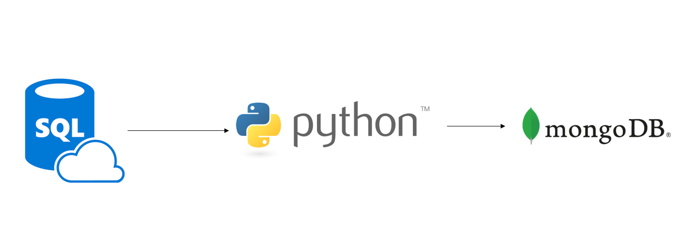
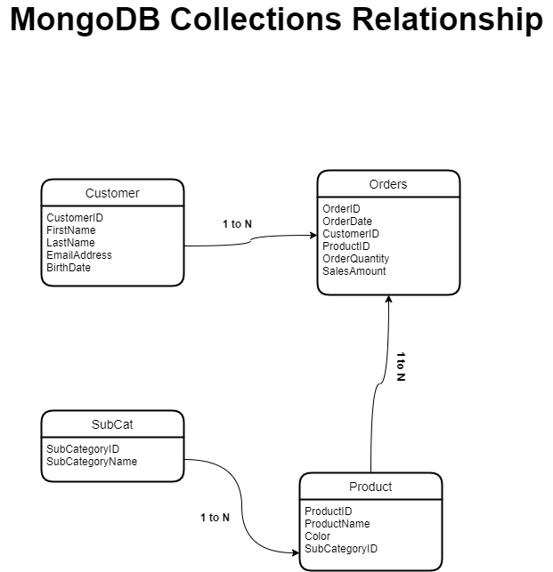

# ETL pipeline - Azure SQL Database, Python and MongoDB

In this project, I built an ETL pipeline that transffered data from an Azure Database to a MongoDB database using Python. Below is the data model and architecture.

